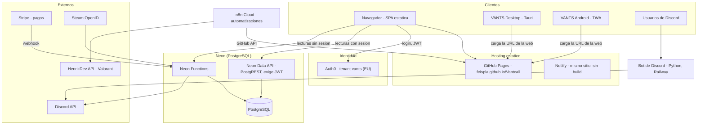
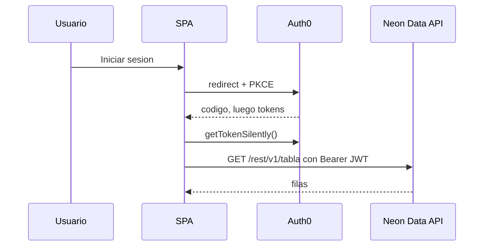

# VANTS — Arquitectura del repositorio

> Documento para lectura rápida por humanos y bots. Los diagramas son Mermaid (GitHub los renderiza).
> Stack actual: **Auth0** (identidad) + **Neon** (PostgreSQL, Data API y Neon Functions). Supabase ya no se usa.

## 1. Vista general

## 2. Frontend (raíz del repo)

Sitio estático **sin build ni `package.json`**: HTML + JS + CSS cargados con `<script>` en `index.html`. El control de caché se hace con `?v=N` en cada script (hay que subirlo a mano al cambiar un archivo).

| Archivo | Rol |
|---|---|
| `index.html` | Shell, navegación, SEO y carga de scripts |
| `app.js` | Router por hash (`#/ruta`) y vistas principales |
| `auth0-config.js` | Cliente Auth0 SPA + cliente PostgREST hacia Neon (`window.VantDB`); reemplazó al antiguo `db.js` |
| `auth.js` | Sesión, cuenta (`renderAccount`), perfil, identidades vinculadas |
| `auth-pages.js` | Pantallas de login y registro |
| `profile-extras.js` | Botones y bloques extra del perfil (Agregar amigos, FACEIT, Streamer); se inyecta con `MutationObserver` y `mountAccount(root)` |
| `socials.js`, `streamer.js`, `faceit.js`, `faceit-matches.js`, `spotify-player.js` | Integraciones de perfil |
| `zona.js`, `premium.js`, `admin.js` | Zona exclusiva por plan, planes de pago, panel de staff |
| `ranks.js`, `rank-calc.js` | Emblemas y cálculo de rangos |
| `data.js` | Contenido estático / datos de respaldo |
| `desktop-shell.js/.css` | Barra de título y menú lateral; solo se activan dentro de Tauri |
| `sw.js`, `manifest.webmanifest`, `offline.html` | PWA: service worker, manifiesto y página sin conexión |
| `base.css`, `style.css`, `vip.css`, `premium.css`, `bundle.css`, ... | Estilos (`bundle.css` es la concatenación servida) |
| `*.html` sueltos | Páginas auxiliares (`inicio`, `ranked`, `torneos`, `jugadores`, `calendario`, `precios`, legales, 404) |

Vistas de la SPA (router hash): inicio, calendario, ranked, torneos, jugadores, precios, vip, cuenta (`#/cuenta`) y perfiles públicos.

## 3. Autenticación (Auth0)

- Tenant `vants` en la región EU; el SDK `auth0-spa-js` se carga desde `index.html`.
- Configuración en `auth0-config.js`: dominio, client id, audience `https://api.vants.app`, `useRefreshTokens` y caché en `localStorage`.
- El token de acceso (JWT) se envía a la Neon Data API, que valida el JWT y aplica las políticas de la base.
- El `client id` de una SPA es público por diseño; ningún secreto vive en el repo.

## 4. Datos (Neon)

- **Neon Data API** (PostgREST, `.../neondb/rest/v1`): `auth0-config.js` implementa un cliente con la misma interfaz que `VantDB.client` (`from()`, `rpc()`, filtros, orden, límite). Exige siempre un JWT.
- **Proxy público** (Neon Function `vantsdata`): sirve las lecturas sin sesión (por ejemplo ranking e inicio). Su código no está en este repo.
- **Caché**: `VantDB` guarda consultas unos 30 s en memoria.
- Tablas que el frontend consulta (según el código): `seasons`, `ranked_rules`, `leaderboard` (vista de solo lectura), `tournaments`, `tournament_entries`, `players`, además de perfiles e identidades vinculadas.

## 5. Neon Functions (`neon-functions/`)

Definidas en `neon-functions/neon.ts`; usan `pg` con `DATABASE_URL`.

| Función | Qué hace |
|---|---|
| `steam-login` | Flujo OpenID 2.0 de Steam para vincular o iniciar sesión |
| `stripe-webhook` | Recibe webhooks de Stripe y activa compras y planes en la base |
| `discord-notify` | Envía embeds a Discord (registros, torneos, eventos) |

Pendiente conocido: la verificación de firma de Stripe (`verifyStripeSignature`) aún no está implementada y devuelve `true`.

## 6. Apps

- **Desktop (Tauri)**: `desktop/`. La ventana principal carga `https://feispla.github.io/Vantcall/`, así que recibe los cambios de la web sin recompilar. Se recompila solo si cambia `desktop/**` (workflow `desktop-build.yml`).
- **Android (TWA)**: `android/`. Trusted Web Activity que abre la URL de la web, con `UpdateGateActivity` para forzar actualizaciones. Verificación de dominio en `.well-known/assetlinks.json`. Workflow `android-build.yml`.

## 7. Bot de Discord (`bot/`)

Python con `discord.py`, desplegado fuera del repo estático (Railway). Comandos en `bot/commands/` (perfil, vincular, análisis, comunidad, informes, moderación).

> **Deuda técnica:** el bot todavía usa el cliente de Supabase (`bot/utils/supabase_client.py`) y las variables `SUPABASE_URL` / `SUPABASE_SERVICE_ROLE_KEY`. Hay que migrarlo a Neon (conexión directa a PostgreSQL o la Data API) o desactivarlo. Hasta entonces sus comandos no funcionan con el stack actual.

## 8. Automatizaciones (n8n)

- Verificación de Riot ID contra la API de HenrikDev mediante un webhook.
- Agentes y avisos de error hacia Discord.
- Cambios al repo por Pull Request usando la API de GitHub.

## 9. Despliegue

1. Los cambios entran por Pull Request a `main`.
2. GitHub Pages publica la raíz tal cual; Netlify (`netlify.toml`) también, sin paso de build.
3. Tras un cambio de JS o CSS, sube el `?v=` en `index.html`; el service worker (`sw.js`) puede servir versión vieja hasta recargar con Ctrl+Shift+R.
4. Desktop y Android se actualizan solos con la web; solo se recompilan si cambian sus carpetas.

## 10. Notas para bots y agentes

1. `leaderboard` es una vista: nunca hacer INSERT ni UPDATE sobre ella.
2. No hay secretos en el repo. Las claves (Stripe, Discord, `DATABASE_URL`, Steam) van como variables de las Neon Functions o del hosting del bot.
3. Cualquier página nueva debe cargarse desde `index.html` y subir su `?v=`.
4. No reintroducir Supabase: autenticación = Auth0, datos = Neon.
