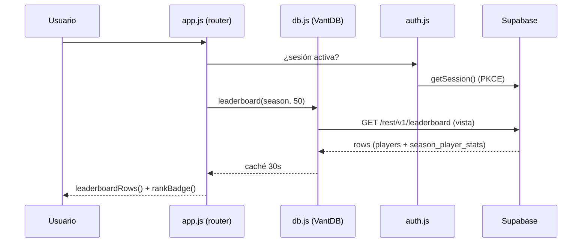
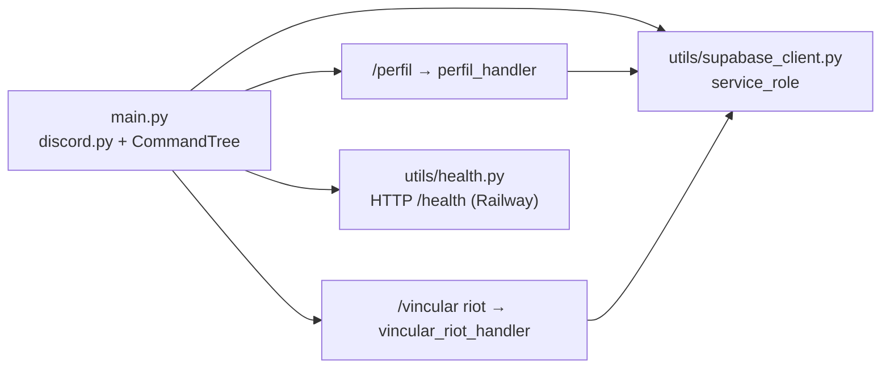
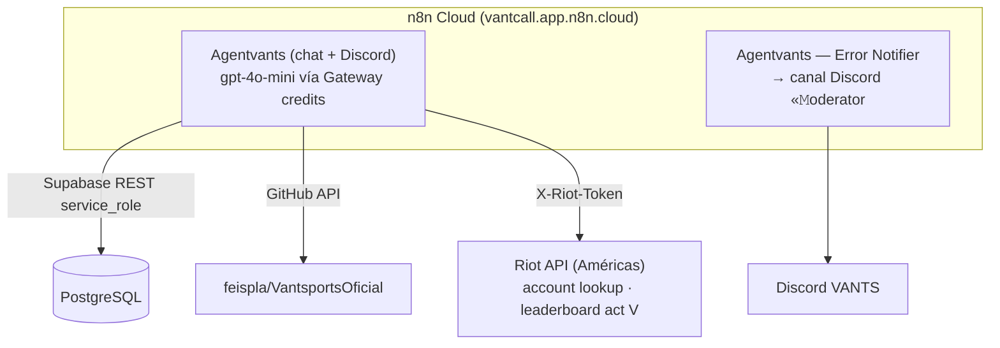

# VANTS — Arquitectura del repositorio

> Documento pensado para lectura rápida por humanos y bots. Los diagramas son Mermaid: GitHub los renderiza como imágenes.

## 1. Vista general del sistema

```mermaid
flowchart TB
    subgraph Clients["Clientes"]
        Browser["Navegador (SPA estática)"]
        DiscordUsers["Usuarios de Discord"]
        Agentvants["Agente n8n Agentvants"]
    end

    subgraph Frontend["Frontend — GitHub (este repo)"]
        Index["index.html"]
        App["app.js — router SPA + vistas"]
        Auth["auth.js — login/sesión"]
        DBjs["db.js — capa de datos Supabase"]
        Admin["admin.js — panel staff"]
        Zona["zona.js — zona exclusiva"]
        Ranks["ranks.js — emblemas de rango"]
        Premium["premium.js / premium.css"]
        Data["data.js — fallback estático"]
        Styles["base.css / style.css / vip.css"]
    end

    subgraph Supabase["Supabase — proyecto qtetsgwwsvqzquxssudj"]
        Postgres[("PostgreSQL + RLS")]
        AuthSVC["Auth (Google, Discord, Steam, email)"]
        EdgeFx["Edge Functions (Deno)"]
        Realtime["REST / Realtime API"]
    end

    subgraph Edge["Edge Functions"]
        FxCmd["discord-commands — slash commands"]
        FxNotify["discord-notify — webhooks a Discord"]
        FxAdmin["discord-admin — registro de comandos"]
        FxSteam["steam-login — OpenID de Steam"]
    end

    subgraph BotPy["Bot Python (bot/)"]
        MainPy["main.py — discord.py"]
        CmdPerfil["commands/perfil.py"]
        CmdVincular["commands/vincular.py"]
        Health["utils/health.py"]
    end

    subgraph External["Servicios externos"]
        DiscordAPI["Discord API"]
        RiotAPI["Riot Games API"]
        Stripe["Stripe (pagos)"]
    end

    Browser --> Index --> App --> DBjs
    App --> Auth
    App --> Zona
    Auth --> AuthSVC
    DBjs --> Realtime --> Postgres
    Admin --> Postgres
    DiscordUsers -->|interactions| FxCmd
    FxCmd --> Postgres
    FxNotify --> DiscordAPI
    FxAdmin --> DiscordAPI
    FxSteam --> AuthSVC
    MainPy --> Postgres
    MainPy --> DiscordAPI
    CmdPerfil --> Postgres
    Agentvants -->|REST service_role| Postgres
    Agentvants -->|lee/escribe| Frontend
    Agentvants --> RiotAPI
    Browser --> Stripe
```



## 2. Mapa del repositorio

```mermaid
flowchart LR
    subgraph Root["/ (raíz — frontend estático)"]
        A["index.html<br/>shell + nav + SEO"]
        B["app.js (55KB)<br/>router hash + todas las vistas"]
        C["auth.js (51KB)<br/>OAuth, sesión, perfiles"]
        D["db.js<br/>VantDB: cliente Supabase + caché"]
        E["admin.js (41KB)<br/>panel de administración"]
        F["zona.js<br/>zona exclusiva por plan"]
        G["ranks.js<br/>emblemas SVG de los 8 rangos"]
        H["premium.js + premium.css<br/>landing de planes"]
        I["data.js (32KB)<br/>contenido estático / fallback"]
        J["base.css + style.css (60KB)<br/>+ vip.css (25KB)"]
    end

    subgraph Assets["assets/"]
        K["brand/ — logos, favicons, og-image"]
        L["ranks/ — 8 rangos en PNG + SVG"]
        M["hero-arena.jpg, banner-setup.jpg"]
    end

    subgraph BotDir["bot/ — bot de Discord en Python"]
        N["main.py — discord.py, tree de comandos"]
        O["commands/perfil.py, vincular.py"]
        P["register_commands.py — sync slash commands"]
        Q["utils/ — health server + cliente Supabase"]
    end

    subgraph SupaDir["supabase/"]
        R["schema.sql — tablas base"]
        S["seed.sql — datos iniciales"]
        T["migrations/ — 4 migraciones"]
        U["functions/ — 4 edge functions Deno"]
    end

    Root --- Assets
    Root -.->|lee/escribe vía REST| SupaDir
    BotDir -.->|service key| SupaDir
```



## 3. Flujo de datos de la SPA



## 4. Base de datos (PostgreSQL + RLS)

```mermaid
erDiagram
    players ||--o{ season_player_stats : "tiene stats en"
    seasons ||--o{ season_player_stats : "agrupa"
    players ||--o{ tournament_entries : "se inscribe"
    tournaments ||--o{ tournament_entries : "recibe"
    tournaments ||--o{ matches : "genera"
    players ||--o{ matches : "juega (p1/p2)"
    players ||--o{ ranked_matches : "juega ranked"
    players ||--|| profiles : "bio/redes"
    players ||--o{ player_identities : "vínculos (Discord, Riot, Steam)"
    bot_commands }o--|| plans : "min_plan"
    events ||--o{ event_rsvps : "asistencias"

    players {
        uuid id PK
        string username
        string display_name
        string region
        boolean verified
    }
    season_player_stats {
        uuid player_id FK
        uuid season_id FK
        int mmr
        int wins
        int losses
        string rank
    }
    leaderboard_view {
        note "VISTA: players + stats de temporada activa, ordenada por MMR. NO acepta INSERT."
    }
```

**Tablas principales:** `players`, `seasons`, `season_player_stats`, `tournaments`, `tournament_entries`, `matches`, `ranked_matches`, `events`, `event_rsvps`, `profiles`, `player_identities`, `bot_commands`, `bot_admins`, `rules`.
**Vista clave:** `leaderboard` (sólo lectura — la usan el home y la página Ranked).
**RLS:** la clave `sb_publishable` (anon) sólo lee lo público; escrituras reales van con `service_role` (bot, edge functions, Agentvants).

## 5. Edge Functions (supabase/functions/, Deno)

| Función | Trigger | Qué hace |
|---|---|---|
| `discord-commands` | POST desde Discord (interactions endpoint) | Ejecuta slash commands (`/perfil`, `/ranking`, `/torneos`, `/ayuda`…) contra la DB con service_role. Catálogo en `public.bot_commands`. |
| `discord-notify` | Webhooks de base de datos | Envía embeds a Discord: registro de usuario, torneo publicado/inscripción/resultado, evento publicado. |
| `discord-admin` | POST con token staff | Re-registra los slash commands en Discord según `bot_commands` (sync). |
| `steam-login` | GET/POST flujo OpenID | Login con Steam → sesión Supabase Auth. |

## 6. Bot de Discord en Python (bot/)



- Desplegado fuera del repo estático (Railway, ver badge en README).
- Variables: `DISCORD_TOKEN`, `DISCORD_GUILD_ID`, credenciales Supabase (`.env.example`).
- `register_commands.py` sincroniza los slash commands con Discord.

## 7. Integraciones externas y agentes



- **Agentvants**: administra la web — lee código del repo, consulta/escribe Supabase, consulta la API de Riot (`riot_account_lookup`, `valorant_ranked` con act_id `8102cd81-43a0-d0d7-bd59-47b8fe9bed1b` — ACT V, cambiar el 14-oct-2026).
- **Stripe**: checkout de planes BASIC/PRO/ELITE (enlaces `#/checkout/<plan>` en `planCards()`).

## 8. Rangos VANTS (compartido por web y bot)

| # | Rango | MMR mínimo | Asset |
|---|---|---|---|
| 1 | Hierro | 0 | `assets/ranks/hierro.(svg,png)` |
| 2 | Bronce | 900 | `assets/ranks/bronce.*` |
| 3 | Plata | 1100 | `assets/ranks/plata.*` |
| 4 | Oro | 1300 | `assets/ranks/oro.*` |
| 5 | Platino | 1500 | `assets/ranks/platino.*` |
| 6 | Diamante | 1700 | `assets/ranks/diamante.*` |
| 7 | Titán | 1900 | `assets/ranks/titan.*` |
| 8 | Escarlata | 2100 | `assets/ranks/escarlata.*` |

Definidos en `app.js` (`VANTS_RANKS`) y renderizados por `ranks.js` (`window.VantsRanks`). La web desplegada en pplx.app sirve una build aparte; este repo es la fuente.

## 9. Notas operativas para bots

1. **`leaderboard` es una vista** — nunca hacer INSERT/UPDATE; escribir en `players` + `season_player_stats` de la temporada activa (`d3ffc87e-3178-4bd2-a33d-413a88b90b7b`, "TEMPORADA 2 VANTS").
2. **Claves**: el frontend usa la anon key (RLS protege); escrituras administrativas requieren `service_role` (nunca en el repo).
3. **Conflictos de merge**: `app.js` quedó limpio el 05-oct-2026 (commit `0a18202c`). `index.html` aún contiene marcadores `feat/diseno-premium`/`main` en el `<head>` (pendiente de resolver).
4. **Vistas de la SPA**: `inicio`, `calendario`, `ranked`, `torneos`, `jugadores`, `jugador/:u`, `torneo/:slug`, `precios`, `vip` (router hash en `app.js`).
5. **Caché**: `db.js` cachea consultas 30s en memoria — datos "en vivo" pero no instantáneos.
