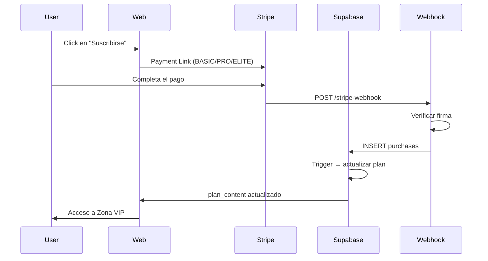

text
<div align="center">
  
  
  # VANTS - Plataforma de Esports Premium
  
  [](LICENSE)
  [](https://supabase.com)
  [](https://discord.com)
  [](https://railway.app/new?template=https://github.com/feispla/VantsportsOficial)
  
  **Plataforma competitiva de esports con autenticación multi-proveedor, pagos con Stripe, integración con Steam/Valorant/Riot, torneos automatizados y bot de Discord.**
  
  **Demo:** [https://vantsbetaa.pplx.app/](https://vantsbetaa.pplx.app/)
</div>

---

## 🚀 Deploy on Railway

Deploy VANTS Discord bot on Railway in one click. Just set your environment variables and you're ready to go!

### Quick Deploy

1. Click the **Deploy on Railway** button above
2. Set these environment variables:
   - `DISCORD_TOKEN` - Your Discord bot token
   - `DISCORD_GUILD_ID` - Your Discord server ID
   - `SUPABASE_URL` - Your Supabase project URL
   - `SUPABASE_SERVICE_ROLE_KEY` - Your Supabase service role key
   - `PORT` - 8080
3. Deploy! Railway will handle the rest

---

## 🎮 About VANTS

VANTS is a complete esports platform for Discord communities:

- **🏆 Tournament Management**: Create and manage tournaments for 12+ games (Valorant, LoL, CS2, MLBB, etc.)
- **📊 Player Rankings**: Track player stats, ranks, and tournament history with real-time leaderboards
- **🎮 Valorant Integration**: Sync with ValoTracker for ranked stats, RR, and match history
- **💳 Payment Processing**: Accept payments for tournament entries via Stripe (BASIC, PRO, ELITE plans)
- **🌐 Multi-Platform**: Web dashboard + Discord bot
- **🔒 Secure**: RLS policies, OAuth authentication, and encrypted secrets in Supabase Vault

---

## 🚀 Características

### Autenticación & Acceso
- ✅ **Supabase Auth** con correo + contraseña (verificación por email, recuperación)
- ✅ **OAuth:** Google, Discord (PKCE flow)
- ✅ **Steam:** OpenID 2.0 vía Edge Functions
- ✅ **Riot Games:** vinculación de cuentas para Valorant

### Pagos & Suscripciones
- 💳 **Stripe live** - Payment Links
  - BASIC: 9 € (IVA incluido)
  - PRO: 19 € (IVA incluido)
  - ELITE: 39 € (IVA incluido)
- 🔔 Webhook automático → actualización de planes en tiempo real
- 🎯 Zona VIP con contenido exclusivo por plan

### Torneos & Competición
- 🏆 Creación y gestión de torneos multi-juego
- 📊 Tablas de clasificación (leaderboards)
- 🎮 12 juegos soportados: LoL, MLBB, FC26, Fortnite, Clash Royale, Rocket League, Valorant, CS2, COD Warzone, Apex Legends, Overwatch 2, Rainbow Six Siege
- 📝 Sistema de inscripción automática
- 🔔 Notificaciones en Discord

### Integraciones Externas
- 🎮 **Steam:** vinculación de cuentas (OpenID 2.0)
- 🔫 **Valorant:** stats ranked vía ValoTracker bot
- 💬 **Discord:** bot `vantcall` con comandos `/vincular riot` y `/perfil`
- 🌐 **Riot Games:** API para datos de jugadores

### Panel de Administración
- 👑 Dashboard exclusivo para admins (`public.web_admins`)
- 📈 Métricas: jugadores, torneos, eventos, ranked, soporte
- 🤖 Gestión del bot Discord (activar/desactivar comandos, sync, announce)
- 💎 Configuración de planes y contenido VIP

---

## 🏗️ Arquitectura
VantsportsOficial/
├── app/ # Frontend (Next.js/React)
│ ├── admin.js # Panel de administración
│ ├── zona.js # Zona VIP
│ └── auth.js # Flujo OAuth PKCE
├── bot/ # Bot de Discord (Python)
│ ├── main.py # Gateway & comandos slash
│ ├── cogs/ # Módulos del bot
│ └── requirements.txt # Dependencias Python
├── supabase/
│ ├── functions/ # Edge Functions
│ │ ├── stripe-webhook/
│ │ ├── link-steam-start/
│ │ ├── link-steam-callback/
│ │ ├── unlink-steam/
│ │ ├── discord-commands/
│ │ ├── discord-admin/
│ │ └── discord-notify/
│ ├── schema.sql # Estructura de BD
│ ├── seed.sql # Datos iniciales
│ └── migrations/ # Migraciones
├── assets/
│ ├── brand/ # Logo, favicon, iconos
│ └── ranks/ # 8 emblemas de rango premium
└── docs/
└── BRAND.md # Guía de marca

text

---

## 🗄️ Base de Datos (Supabase)

### Tablas Principales

| Tabla | Descripción |
|-------|-------------|
| `players` | Perfiles de jugadores (discord_user_id, auth_user_id, plan, verificación) |
| `user_game_accounts` | Cuentas externas vinculadas (Steam, Riot, etc.) con `verified = true` |
| `purchases` | Historial de compras Stripe (client_reference_id = user_id) |
| `tournament_participants` / `tournament_entries` | Inscripciones a torneos |
| `web_events` | Eventos de la web (publicados en Discord #web-eventos) |
| `web_admins` | Lista de administradores (RLS protegido) |
| `plan_content` | Contenido exclusivo por plan (BASIC/PRO/ELITE) |
| `bot_commands` | Catálogo de comandos del bot (activar/desactivar, plan mínimo) |
| `discord_channels` | Canales para notificaciones de torneos/eventos |

### Seguridad (RLS)

- 🔒 `web_admins`: solo lectura/escritura para admins
- 🔒 `purchases`: solo el usuario propietario
- 🔒 `user_game_accounts`: índice único `(user_id, game)`
- 🔒 Secretos en **Supabase Vault** (nunca en el repo)

---

## 🤖 Bot de Discord (`vantcall`)

### Comandos Disponibles

| Comando | Descripción |
|---------|-------------|
| `/vincular riot` | Vincula cuenta de Riot Games al perfil |
| `/perfil` | Muestra stats del jugador (torneos, rango, cuentas vinculadas) |
| `/valorant ranking` | Muestra top 10 de Valorant |
| `/valorant perfil` | Muestra stats de Valorant de un jugador |
| `/status` | Estado del bot (solo staff) |
| `/connect` | Conecta el servidor con VANTS (guarda token en Vault) |
| `/sync` | Sincroniza datos de torneos y jugadores |
| `/announce` | Publica anuncios en canales configurados |

### Implementación

- **Gateway (Python):** `bot/main.py` con `discord.py`
- **HTTP Interactions (Edge Functions):** `discord-commands`, `discord-admin`, `discord-notify`
- **Despliegue:** Railway/Render con variables de entorno:
  ```bash
  DISCORD_TOKEN=<tu_token>
  SUPABASE_URL=https://qtetsgwwsvqzquxssudj.supabase.co
  SUPABASE_SERVICE_ROLE_KEY=<service_role_key>
  ```

> ⚠️ **Nota:** Si usas el endpoint HTTP (Edge Functions), Discord solo envía interacciones al endpoint, no al gateway Python.

---

## 🔐 Seguridad & Secretos

### Variables de Entorno (Nunca en el repo)

| Variable | Ubicación | Uso |
|----------|-----------|-----|
| `STRIPE_WEBHOOK_SECRET` | Supabase Vault / .env | Verificar firma de webhooks |
| `STEAM_WEB_API_KEY` | Supabase Vault | API de Steam (OpenID) |
| `DISCORD_TOKEN` | Supabase Vault / .env | Bot de Discord |
| `SUPABASE_SERVICE_ROLE_KEY` | Supabase Vault / .env | Operaciones admin en BD |
| `STEAM_LOGIN_REDIRECTS` | Supabase Vault | Lista de destinos permitidos |

### OAuth Configuration

- **Site URL:** `https://vantsbetaa.pplx.app`
- **Redirect URLs:** `https://vantsbetaa.pplx.app/**`
- **Discord Client ID:** `1552959749891297320`
- **Discord Redirect:** `https://qtetsgwwsvqzquxssudj.supabase.co/auth/v1/callback`
- **Google Cloud Redirect:** `https://qtetsgwwsvqzquxssudj.supabase.co/auth/v1/callback`

---

## 🛠️ Instalación & Desarrollo

### Prerrequisitos

- Node.js 18+
- Python 3.10+
- Supabase CLI (opcional)

### Frontend

```bash
# Instalar dependencias
npm install

# Variables de entorno (.env.local)
NEXT_PUBLIC_SUPABASE_URL=[https://qtetsgwwsvqzquxssudj.supabase.co](https://qtetsgwwsvqzquxssudj.supabase.co)
NEXT_PUBLIC_SUPABASE_ANON_KEY=<anon_key>

# Desarrollo
npm run dev

# Producción
npm run build
npm run start
```

### Bot de Discord

```bash
cd bot

# Instalar dependencias
pip install -r requirements.txt

# Copiar y configurar .env
cp .env.example .env
# Editar: DISCORD_TOKEN, SUPABASE_SERVICE_ROLE_KEY

# Ejecutar
python main.py
# O desde la raíz: python bot/main.py
```

### Edge Functions

```bash
# Instalar Supabase CLI
npm install -g supabase

# Login
supabase login

# Link al proyecto
supabase link --project-ref qtetsgwwsvqzquxssudj

# Deploy de funciones
supabase functions deploy stripe-webhook
supabase functions deploy link-steam-start
supabase functions deploy discord-commands
# ... etc
```

---

## 📊 Flujo de Pagos (Stripe)



---

## 🎨 Branding & Diseño

- **Logo:** `assets/brand/` (favicon, icono Discord, imagen social)
- **Rangos:** 8 emblemas premium en `assets/ranks/` (generados por `ranks.js`)
- **Guía completa:** [`assets/BRAND.md`](assets/BRAND.md)

---

## 📝 Scripts SQL

### Esquema Base

```bash
supabase/db/schema.sql      # Tablas principales
supabase/db/seed.sql        # Datos iniciales
supabase/db/admin.sql       # Configurar administradores
supabase/db/owner.sql       # Configurar propietario
```

### Ejecutar Migraciones

```bash
# Conectar al proyecto
psql -h db.qtetsgwwsvqzquxssudj.supabase.co -U postgres -d postgres

# Ejecutar scripts
\i schema.sql
\i seed.sql
\i admin.sql
\i owner.sql
```

---

## 🔧 Troubleshooting

### Error `invalid_client` en Discord OAuth

1. Ve a [Discord Developer Portal](https://discord.com/developers/applications)
2. OAuth2 → **Reset Secret**
3. Copia el nuevo Client Secret
4. Supabase → Authentication → Providers → Discord → pega el nuevo secret
5. Redirect obligatoria: `https://qtetsgwwsvqzquxssudj.supabase.co/auth/v1/callback`

### Bot no responde a comandos

- Verifica que `DISCORD_TOKEN` esté correcto en .env
- Revisa que el bot tenga permisos en el servidor
- Si usas Edge Functions, asegúrate de que el endpoint esté activo

### Webhook de Stripe no funciona

- Verifica `STRIPE_WEBHOOK_SECRET` en Supabase Vault
- Prueba el endpoint con [Stripe CLI](https://stripe.com/docs/stripe-cli):
  ```bash
  stripe listen --forward-to https://qtetsgwwsvqzquxssudj.supabase.co/functions/v1/stripe-webhook
  ```

---

## 📄 Licencia

MIT License - ver [LICENSE](LICENSE) para más detalles.

---

## 🤝 Contribuir

1. Fork el repo
2. Crea una rama (`git checkout -b feature/nueva-funcionalidad`)
3. Commit (`git commit -m 'Añade nueva funcionalidad'`)
4. Push (`git push origin feature/nueva-funcionalidad`)
5. Pull Request

---

## 📞 Contacto

- **Web:** [https://vantsbetaa.pplx.app/](https://vantsbetaa.pplx.app/)
- **Discord:** Únete al servidor oficial
- **Email:** [feisplaa@gmail.com](mailto:feisplaa@gmail.com)

---

<div align="center">

**Hecho con ❤️ por VANTS Team**

[](https://supabase.com)
[](https://discord.com)
[](https://stripe.com)
[](https://railway.app/new?template=https://github.com/feispla/VantsportsOficial)

</div>
